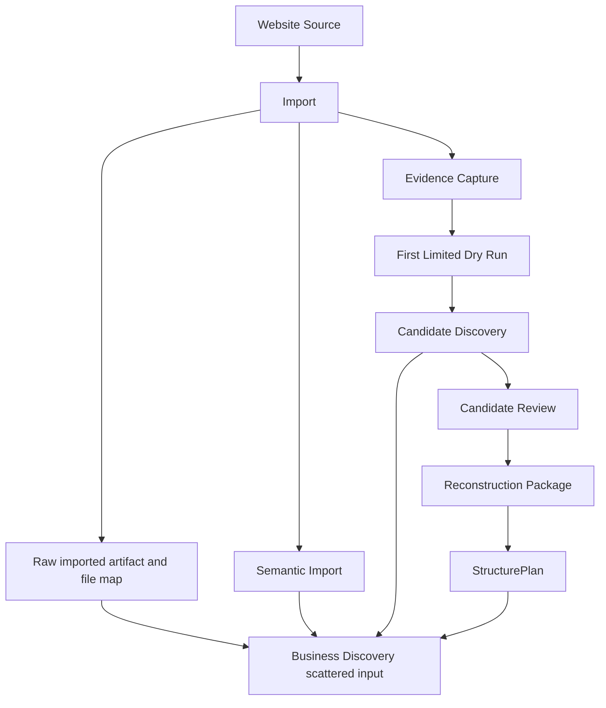
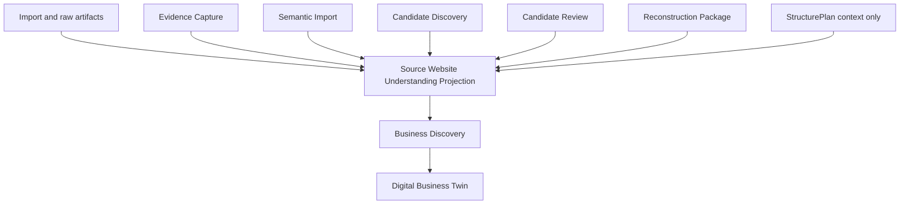
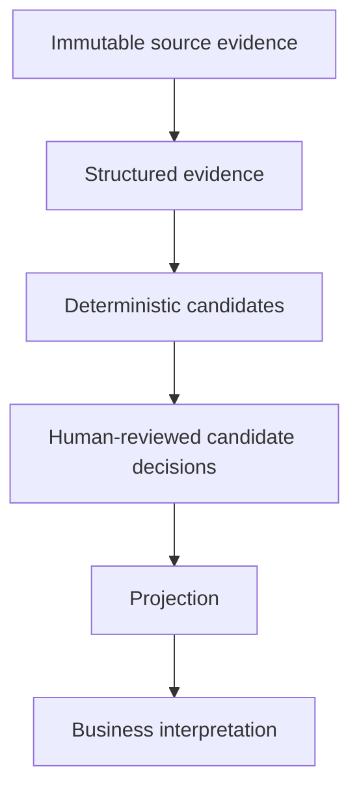
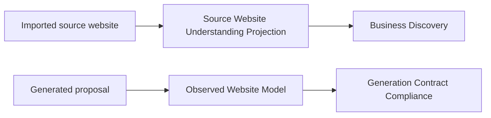
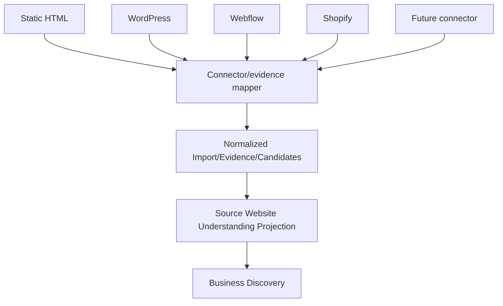
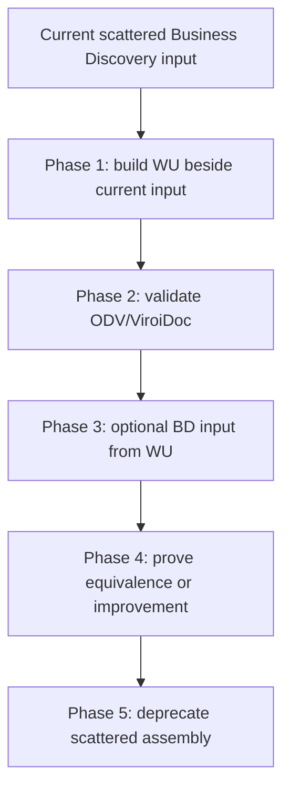

# Source Website Understanding Projection Specification

## Phase Boundary

Phase WU-1 defines the canonical Source Website Understanding Projection
boundary.

This phase is documentation and contract design only. It does not implement a
runtime builder, projection loader, persistence, schema, API, UI, workers, new
extraction, new HTML parsing, a new asset registry, asset classification
runtime, visual identity inference, AI analysis, Business Discovery changes,
DBT changes, WDB/WGP changes, provider behavior, generation, publishing,
deployment, DNS mutation, production mutation, or runtime refactors.

## Canonical Definition

Source Website Understanding Projection:

> A deterministic, connector-neutral, evidence-backed, read-only projection of
> the current structured understanding of an imported source website.

The projection answers:

```text
What does GNR8 currently know, observe, and still not understand about this
imported website?
```

The projection is:

- derived;
- read-only;
- evidence-backed;
- deterministic;
- connector-neutral;
- fail-closed;
- non-canonical business truth;
- non-planning;
- non-generation.

It is not:

- business truth;
- a reconstruction artifact;
- a planning artifact;
- a generation contract;
- a generated-site observation;
- a provider payload;
- a prompt;
- a replacement for Import, Evidence Capture, Candidate Discovery, Candidate
  Review, Reconstruction Package, StructurePlan, Business Discovery, or
  Observed Website Model.

## Architectural Position

Canonical relationship:

```text
Website Source
-> Import
-> Raw Evidence
-> Structured Evidence
-> Candidate Discovery / Review
-> Source Website Understanding Projection
-> Business Discovery
-> Digital Business Twin
```

The projection composes existing artifacts into one source-site read model.
It does not create a new extraction pipeline or a new source of authority.

## Persistence Policy

Preferred model: **A. Pure runtime projection with no dedicated persistence.**

This is the smallest safe model because the projection is a deterministic
composition of existing persisted/provenance-backed artifacts. Current
repository reality already persists the authoritative inputs: import
provenance, raw imported artifacts, Evidence Capture baselines, Candidate
Discovery results, Candidate Review packages, Reconstruction Packages,
StructurePlans, and Business Discovery artifacts. Persisting a new canonical
projection now would create a second artifact history before WU has proven
that recomputation is too expensive or unstable.

Rejected models:

| Model | Reason rejected for WU-1 |
| --- | --- |
| B. Persisted derived projection in existing provenance storage | Possible later as a cache/snapshot, but premature while the projection contract is still validating its exact runtime shape. |
| C. Persisted canonical artifact | Too heavy. It would imply governance and artifact ownership that belongs to upstream evidence/candidate/review/business layers. |

Recomputation occurs when a reader asks for source-site understanding for a
siteVersionId and an exact set of source artifact refs. A future builder should
load the latest eligible upstream heads, verify lineage, compose the read
model, validate it, and return it without writing a new artifact.

Source artifact IDs are preserved by carrying exact refs in lineage:

- sourceImportArtifactRefs;
- sourceEvidenceArtifactRefs;
- sourceCandidateArtifactRefs;
- sourceReviewArtifactRefs;
- sourceReconstructionArtifactRefs;
- optional StructurePlan refs as downstream context;
- diagnostics for any missing or stale refs.

Stale inputs are detected by comparing the exact artifact refs used by each
input to the latest expected upstream head for the same siteVersionId/dryRunId
lineage. Stale inputs do not become fresh by being projected. They remain
visible as stale limitations and readiness blockers.

Reproducibility is guaranteed by deterministic input selection, exact artifact
refs, a contractVersion, stable sorting, normalized projection content, and a
deterministic projection key. A future runtime can rebuild the same projection
from the same refs and compare normalized output for equality.

The projection remains inspectable because it exposes source refs,
knowledge-state, confidence, limitations, diagnostics, readiness dimensions,
and lineage instead of collapsing them into a single status.

## Deterministic Identity

The projection should use a deterministic projection key derived conceptually
from:

- siteVersionId;
- sourceSiteId when available;
- dryRunId where relevant;
- contractVersion;
- exact source artifact IDs;
- normalized projection content.

If not persisted, the key still supports repeatability, equality checks,
debugging, logs, future caching, and real-target validation. The key is not a
canonical artifact ID and must not imply that a persisted projection exists.

## Allowed Projection Inputs

The projection may consume only upstream source-site artifacts and immediate
planning context. It may not consume downstream business/generation/generated
observation artifacts listed in the forbidden feedback section.

| Input class | Required | Contributes | Authority level | Missing/stale behavior | Review exposure | Role |
| --- | --- | --- | --- | --- | --- | --- |
| source import metadata | Required | siteVersionId, sourceSiteId, dryRunId, source mode, import timestamps, import status | Import authority | projection invalid if no import identity exists; missing sourceSiteId is a blocking readiness limitation for Business Discovery shadow construction | n/a | evidence |
| source URL / hostname | Required when known | source identity, hostname, connector/source type hints | Import authority | explicit missing source URL limitation if absent | n/a | evidence |
| imported raw artifact metadata | Optional but expected | raw artifact ID, file map, entry HTML, source file availability, asset refs | Raw evidence | mark unavailable/missing; do not infer files | n/a | evidence |
| route inventory | Required for ready state, optional for buildability | pages, routes, availability, titles, route confidence | Structured evidence/candidate | readiness not_ready/partially_ready when absent | unreviewed routes may be exposed as candidates | evidence/candidates |
| asset registry | Optional but expected | files, media types, paths, sizes, hashes, source references | Raw evidence | incomplete asset inventory limitation | unreviewed meanings stay candidates/unresolved | evidence |
| semantic import result | Optional | title, language, headings, body summaries, sections, images, CTAs, forms | Structured evidence | mark unavailable; never reparse HTML in projection | unreviewed semantic roles stay structured/candidate | evidence/candidates |
| Evidence Capture artifacts | Optional but expected | rendered DOM refs, screenshots, computed styles, layout/navigation/section evidence | Structured evidence | evidence completeness limitation; fail closed for readiness | n/a | evidence |
| rendered capture evidence | Optional | browser-observed availability, screenshots, geometry, styles, rendered text quality | Immutable/structured evidence | unavailable if worker/capture missing; do not substitute generated output | n/a | evidence |
| Candidate Discovery result | Optional but expected for route/nav/section candidates | deterministic candidates, candidate IDs, confidence, reasons, evidence refs | Deterministic candidates | mark candidate discovery missing; do not synthesize candidate IDs | unreviewed candidates may be exposed as candidate | candidates |
| Candidate Review package / decisions | Optional | latest decisions, review events, approved/rejected/deferred/unreviewed state | Human governance over candidates | missing review means unreviewed, not approved | reviewed and rejected remain visible | reviewed candidates |
| Reconstruction Package | Optional | eligibility, blockers, approved candidate refs, limitations, diagnostics, lineage | Reviewed reconstruction eligibility | blocked/missing remains explicit; projection can still build | approved refs preferred for presentation only | reviewed context |
| StructurePlan | Optional context only | planned organization from approved candidates | Planning projection | stale/missing context does not block source understanding | reviewed source refs remain separate | planning context |
| current limitations and diagnostics | Required where emitted upstream | completeness, stale inputs, conflicts, unsupported evidence, mapper limits | Layer-local diagnostics | propagate and normalize; never hide; Evidence Capture baseline/fidelity limitations must preserve original messages, codes/types, severity/state, source refs, and artifact refs | n/a | governance |

WU-5 section lineage requirement:

Source section projection rows must preserve, when available, the exact upstream
section-boundary identity in addition to the WU projection identity:

- `sectionId`: deterministic WU projection ID;
- `sourceSectionId`: original upstream section-boundary or planning section ID;
- `semanticType`: upstream semantic label when available;
- `regionType`: exact `SectionBoundaryRegionType` when available;
- `evidenceRefs`: exact upstream refs, including
  `evidence:section-boundary:<routePath>:<sectionId>`;
- `sourceCandidateId`: Candidate Discovery candidate ref when applicable;
- `reviewState`: Candidate Review state when applicable;
- `sourceArtifactRefs`: producing source artifact refs;
- `limitations`: local limitations without inferred business meaning.

The projection must not create section-boundary refs from semantic-import-only
sections. If a downstream adapter requires section-boundary lineage, it must use
only exact projected refs or fail closed.

## Authority Hierarchy

Authority order:

```text
Immutable source evidence
-> Structured evidence
-> Deterministic candidates
-> Human-reviewed candidate decisions
-> Projection
-> Business interpretation
```

Conflict resolution rules:

- Immutable source evidence outranks derived candidates.
- Structured evidence may organize immutable evidence but may not invent
  source facts.
- Deterministic candidates preserve their original confidence and evidence
  refs.
- A reviewed candidate decision overrides unreviewed candidate status for the
  same exact candidate identity.
- A rejected candidate remains visible as rejected evidence; it is not deleted.
- Reconstruction Package eligibility may indicate which reviewed candidates
  are reconstruction-eligible, but it does not erase non-eligible evidence.
- StructurePlan must not override observed source structure.
- Business Discovery must not feed back into source-site understanding.
- Generated website observations must never enter source-site understanding.
- When inputs disagree, the projection marks the item conflicting and records
  all relevant refs.

## Knowledge-State Model

Every projected item must carry one knowledge state:

| State | Meaning |
| --- | --- |
| observed | Directly observed in immutable source evidence. |
| structured | Organized from observed evidence by an upstream deterministic parser/capture layer. |
| candidate | Proposed meaning from deterministic candidate extraction. |
| reviewed | Candidate has a recorded governance outcome. |
| confirmed_source_fact | Confirmed about the source website, not confirmed business truth. |
| rejected | Reviewed or invalidated candidate should not be treated as accepted. |
| conflicting | Inputs disagree or evidence supports incompatible interpretations. |
| missing | Expected evidence was checked and not found. |
| unavailable | Evidence cannot be checked because the source/artifact/capture is absent or inaccessible. |

`confirmed_source_fact` means confirmed about the imported website source. It
does not mean the business itself has confirmed a fact as canonical DBT truth.

`candidate` cannot silently become DBT knowledge. `reviewed` records a
governance outcome, but a reviewed source candidate may still remain
non-canonical business knowledge. `missing` and `unavailable` must not be
collapsed.

## Confidence Model

Confidence should remain compatible with existing GNR8 confidence vocabulary:
LOW, MEDIUM, HIGH, plus explicit unavailable/invalid where validation cannot
evaluate confidence.

Confidence inputs:

- directness of evidence;
- number of independent evidence references;
- consistency across inputs;
- review state;
- recency;
- coverage;
- ambiguity;
- source authority.

Propagation rules:

- Low-confidence upstream signals remain low-confidence downstream.
- Review can reduce ambiguity but must not erase missing evidence.
- Aggregate counts do not raise confidence by themselves.
- Multiple refs from the same artifact family count as supporting detail, not
  independent authority.
- Conflicts cap confidence at LOW until resolved or reviewed.
- Stale inputs reduce readiness and may reduce confidence, but must remain
  inspectable.
- Missing and unavailable items have no positive confidence.

## WU-4 Implementation Note

WU-4 implements the Business Discovery shadow-adapter requirements without
changing the persistence policy:

- `sourceSiteId` is first-class projection identity and is copied from the
  authoritative runtime site-version boundary.
- Evidence Capture baseline/fidelity limitations are first-class projection
  limitations and preserve the exact messages and lineage needed by current
  Business Discovery.
- Missing `sourceSiteId` fails closed with a blocking limitation.
- Projection identity changes when these fields are present because normalized
  projection content changed.
- Business Discovery may be built from WU in shadow mode only; WU-4 does not
  authorize production input migration.

## Projection Domains

### A. Source Identity

Expose source URL, hostname, import identity, capture/import timestamps,
language signals, source type, and connector type where known.

### B. Page And Route Inventory

Expose pages, routes, route purpose candidates, page titles, page
availability, route confidence, route evidence refs, and missing route
observations.

### C. Navigation

Expose primary navigation, secondary navigation, footer navigation, external
links, social links, contact links, and unresolved navigation candidates.

### D. Structure

Expose sections, headings, semantic section types, section ordering,
layout/geometry evidence where available, and unresolved section candidates.

### E. Content

Expose body text availability, content themes, visible messages, CTAs, contact
signals, forms, downloads, metadata, structured data, and missing content
observations.

### F. Assets

Expose images, SVGs, icons, fonts, videos, documents, other files, asset usage
references, classification status, candidate meanings, and unresolved assets.

### G. Visual Identity Signals

Expose logo candidates, color signals, typography signals, icon style signals,
image style signals, visual consistency signals, and explicit unresolved
state.

### H. Business Signal Candidates

Expose identity signals, offering signals, audience signals, goal signals,
trust signals, differentiator signals, geographic signals, and
language/market signals. These remain candidates, not business truth.

### I. Technical And SEO Signals

Expose title/meta, headings, structured data, canonical URL, robots/sitemap
signals where available, accessibility observations, external
scripts/widgets, and technology hints.

### J. Readiness And Governance

Expose evidence completeness, candidate review state, reconstruction
eligibility, unresolved conflicts, missing evidence, limitations, and
diagnostics.

## Conceptual Contract Types

These are conceptual contracts only. WU-1 does not define TypeScript.

| Concept | Responsibility |
| --- | --- |
| SourceWebsiteUnderstandingProjection | Top-level deterministic read model for one imported source website. |
| SourceWebsiteUnderstandingLineage | Exact source artifact refs, contract version, input selection, stale checks, and forbidden-artifact proof. |
| SourceWebsiteIdentity | URL, hostname, connector/source type, import identity, timestamps, language signals. |
| SourcePageUnderstanding | Page and route state, titles, availability, purpose candidates, evidence, confidence, limitations. |
| SourceNavigationUnderstanding | Navigation groups, link roles, social/contact/external links, unresolved nav candidates. |
| SourceSectionUnderstanding | Sections, headings, semantic roles, ordering, geometry refs, candidate/review state. |
| SourceContentUnderstanding | Body text availability, messages, CTAs, contact/form/download/metadata/structured-data signals. |
| SourceAssetUnderstanding | Asset inventory, usage refs, file classes, candidate meanings, unresolved assets. |
| SourceVisualIdentitySignals | Logo/color/font/icon/image/style candidates and unresolved visual identity state. |
| SourceBusinessSignalCandidates | Offering, audience, identity, goal, trust, differentiator, geography, and language candidates. |
| SourceTechnicalSignals | SEO, accessibility, canonical, robots/sitemap, widgets, script, and technology hints. |
| SourceWebsiteReadiness | Overall status plus named readiness dimensions. |
| SourceWebsiteConfidence | Confidence value, inputs, caps, propagation reasons, and ambiguity notes. |
| SourceWebsiteLimitation | Human-readable and machine-readable limitation with domain, severity, evidence refs. |
| SourceWebsiteDiagnostic | Technical diagnostic for missing, stale, conflicting, unsupported, or invalid inputs. |
| SourceWebsiteUnderstandingValidationResult | Validation outcome for lineage, states, confidence, readiness, IDs, and forbidden data. |

## Top-Level Projection Shape

Conceptual shape:

```text
SourceWebsiteUnderstandingProjection
  projectionId or deterministic projection key
  contractVersion
  siteVersionId
  dryRunId
  sourceImportArtifactRefs
  sourceEvidenceArtifactRefs
  sourceCandidateArtifactRefs
  sourceReviewArtifactRefs
  sourceReconstructionArtifactRefs
  generatedAt
  sourceIdentity
  pages
  routes
  navigation
  sections
  content
  assets
  visualIdentitySignals
  businessSignalCandidates
  technicalSignals
  readiness
  confidence
  limitations
  diagnostics
  lineage
```

Not every field must be populated. Missing data must remain explicit.

## Readiness Model

Statuses:

| Status | Meaning |
| --- | --- |
| not_ready | Required source identity or minimum source evidence is missing. |
| partially_ready | Some structured source understanding exists, but important domains are incomplete or unreviewed. |
| ready_for_business_discovery | Sufficient structured source understanding exists for conservative Business Discovery. |
| blocked | A required upstream artifact is unavailable, invalid, or contradictory in a way that prevents safe interpretation. |
| stale | One or more selected inputs are not the expected latest/equivalent source-lineage heads. |
| invalid | Validation failed because lineage, states, evidence refs, IDs, or forbidden data are unsafe. |

`ready_for_business_discovery` does not mean business truth is complete, CGP
is complete, offerings are confirmed, audience is confirmed, or generation is
ready. It means there is sufficient structured source understanding for
conservative Business Discovery.

Readiness dimensions:

- source acquisition;
- route coverage;
- navigation coverage;
- content coverage;
- asset inventory;
- candidate review;
- visual identity signals;
- business signal candidates;
- evidence quality;
- unresolved conflicts.

Readiness must not be represented only as a single opaque score.

## Fail-Closed Behavior

| Scenario | Behavior |
| --- | --- |
| import is missing | projection invalid or blocked; no source facts fabricated. |
| evidence capture is missing | build only from safe import/semantic/candidate inputs; readiness partially_ready or not_ready with limitation. |
| Candidate Discovery is missing | expose evidence without deterministic candidates; mark candidate domains missing/unavailable. |
| review is missing | expose candidates as unreviewed; do not treat them as approved. |
| Reconstruction Package is blocked | expose blockers and lineage; do not imply reconstruction eligibility. |
| asset registry is incomplete | expose available assets and incomplete inventory limitation. |
| source files are unavailable | mark unavailable; do not infer from screenshots or generated output. |
| artifacts disagree | mark conflicting, lower confidence, surface diagnostics. |
| source artifacts are stale | readiness stale; preserve stale refs and latest-head diagnostic. |
| StructurePlan exists but observed evidence is incomplete | show StructurePlan only as planning context; do not use it as proof of source reality. |

The projection should remain buildable where safe, with explicit limitations.
It must not fabricate completeness.

## Candidate Discovery Relationship

Candidate Discovery remains the owner of:

- candidate extraction;
- confidence;
- evidence references;
- deterministic candidate identities.

The projection:

- consumes candidates;
- organizes them by website domain;
- exposes review status;
- does not recreate candidates;
- does not change confidence;
- does not silently approve them.

## Candidate Review Relationship

Candidate Review remains the governance boundary for reviewed structural
candidates and future reviewed non-structural candidates.

The projection:

- exposes latest review decision;
- preserves rejected and unresolved candidates;
- does not mutate review state;
- may prefer reviewed results in presentation;
- never deletes historical candidate evidence.

## Reconstruction Package Relationship

Reconstruction Package remains the exact reviewed reconstruction-eligibility
artifact. It is not the complete source-site understanding model.

The projection may consume:

- eligibility;
- blockers;
- approved candidate references;
- limitations;
- lineage.

It must not broaden Reconstruction Package responsibilities.

## StructurePlan Relationship

StructurePlan is a planning projection. The Source Website Understanding
Projection may expose StructurePlan only as downstream context.

It must not use planned routes or sections as proof of source reality.

Separate:

```text
Observed source structure
```

from:

```text
Planned future structure
```

## Business Discovery Relationship

Business Discovery should eventually consume the projection rather than
scattered raw inputs.

Future conceptual input boundary:

```text
buildBusinessDiscoveryFromWebsiteUnderstanding(...)
```

This phase does not implement it.

Business Discovery may consume these projection domains:

- source identity;
- reviewed navigation;
- reviewed sections;
- content themes;
- business signal candidates;
- visual identity signals;
- asset summaries;
- contact/trust/goal signals;
- readiness;
- limitations;
- diagnostics.

Business Discovery remains responsible for business interpretation. The
projection supplies source-site understanding and candidates; it does not
create DBT facts.

## Forbidden Feedback

The projection must never consume:

- Digital Business Twin;
- Business Understanding Report;
- Business Alignment;
- Website Design Brief;
- Website Generation Package;
- provider payload;
- generated proposal;
- Observed Website Model;
- compliance;
- improvement plan;
- evolution analysis;
- published-site state.

This protects causal direction.

## Source Understanding Versus Observed Website Model

| Dimension | Source Website Understanding Projection | Observed Website Model |
| --- | --- | --- |
| Observes | Imported source website. | Generated website proposal. |
| Lineage | Import, Evidence, Candidate Discovery/Review, Reconstruction Package, StructurePlan context. | GeneratedWebsiteProposalArtifact and observation run. |
| Feeds | Business Discovery. | Generation Contract Compliance. |
| Meaning | What GNR8 understands about the source site. | What GNR8 observes in generated output. |
| Forbidden use | Must not consume generated output. | Must not rewrite source understanding. |

Shared vocabulary may include pages, routes, sections, navigation, messages,
assets, technical signals, evidence, and limitations. The artifacts remain
separate because they observe different realities, have different lineage, feed
different downstream systems, and generated output must not rewrite source
understanding.

## Connector-Neutrality Rules

The projection contract is independent of static HTML, WordPress, Joomla,
Webflow, Shopify, Ecwid, Mono, and future connectors.

Connector-specific modules may map source data into existing
Import/Evidence/Candidate contracts. The projection exposes normalized
concepts only:

- source identity;
- pages/routes;
- navigation;
- sections;
- content;
- assets;
- visual identity signals;
- business signal candidates;
- technical signals;
- readiness;
- limitations;
- diagnostics;
- lineage.

Connector-specific logic must stay upstream of the projection or inside
connector mappers. It must not be embedded in Business Discovery or DBT as a
shortcut.

## Asset Understanding Boundary

Asset Inventory = what files exist.

Asset Evidence = where/how they are used.

Asset Candidate Meaning = possible logo/icon/font/image role.

Human Confirmation = governed acceptance.

Canonical DBT Visual Identity = confirmed business knowledge.

The projection should expose Asset Inventory, Asset Evidence, and Asset
Candidate Meaning. It must not create Human Confirmation or Canonical DBT
Visual Identity.

## Visual Identity Candidate Policy

For logo, colors, fonts, icon style, image style, and visual style, the
projection may expose:

- observed signal: directly observed source evidence such as file, DOM, CSS,
  screenshot, computed style, or semantic import signal;
- candidate: possible meaning with evidence refs and confidence;
- reviewed candidate: candidate with explicit review outcome;
- unresolved: missing, conflicting, unavailable, or insufficient evidence.

The projection must not call any candidate canonical brand identity. Logo,
canonical colors, canonical typography, and visual style remain non-canonical
until governed confirmation and DBT update occur outside this projection.

## Business Signal Candidate Policy

Business signal candidates include offerings, audience, business identity,
goals, differentiators, trust, geography, and languages.

Minimum evidence requirements:

- at least one source evidence ref for every observed/candidate signal;
- confidence visible beside each candidate;
- conflict visibility when signals disagree;
- missing/unavailable state when evidence cannot support the candidate;
- review requirement before source candidates can be treated as governed;
- Business Discovery consumption as candidates/limitations, not DBT facts.

Business Discovery may interpret these signals conservatively, but the
projection itself does not define offerings, audience, or identity as
canonical DBT facts.

## Diagnostics And Limitations

Diagnostics should identify:

- source artifact availability;
- domain coverage;
- stale artifacts;
- conflicting inputs;
- review gaps;
- unsupported evidence types;
- projection completeness;
- connector mapper limitations.

Limitations must be human-readable and machine-readable where possible. A
limitation should include domain, code, severity, message, evidence refs where
available, and whether it blocks readiness.

## Validation Rules

Conceptual validator:

```text
validateSourceWebsiteUnderstandingProjection(...)
```

Validation should check:

- required site/source identity;
- source artifact lineage;
- no forbidden downstream artifacts;
- valid knowledge states;
- evidence references for observed/candidate items;
- confidence validity;
- readiness consistency;
- unique IDs;
- no planned-source conflation;
- no candidate-to-truth promotion;
- no generated-site data.

Invalid projections fail closed and must include diagnostics explaining why.

## Anti-Duplication Rules

Do not rebuild:

- HTML parsing;
- asset extraction;
- semantic import;
- Evidence Capture;
- Candidate Discovery;
- Candidate Review;
- Reconstruction eligibility;
- StructurePlan;
- Business Discovery;
- OWM observation.

The projection is composition and normalization only.

## MVP Scope

P0:

- source identity;
- routes;
- navigation;
- sections;
- body text availability;
- content themes;
- CTA/contact signals;
- asset inventory;
- logo candidates;
- font signals;
- color signals;
- offering candidates;
- audience candidates;
- trust signals;
- evidence refs;
- readiness;
- limitations;
- diagnostics.

P1:

- deeper visual-style signals;
- structured SEO/social mapping;
- forms/downloads;
- external widget inventory;
- richer geometry.

P2:

- advanced network/script behavior;
- visual embeddings;
- AI-assisted classification;
- automated style clustering.

## Real-Target Acceptance Criteria

For ODV and ViroiDoc, future runtime proof must show:

- projection builds without new extraction;
- exact source artifact refs preserved;
- routes/navigation/sections represented;
- body-text availability represented;
- assets represented;
- unresolved assets remain unresolved;
- offerings/audience candidates represented where evidence exists;
- logo/font/color signals represented as candidates;
- missing knowledge remains explicit;
- readiness is fail-closed;
- deterministic rebuild equality;
- no downstream artifact contamination.

## Future Runtime Module Boundaries

Recommended conceptual future files:

```text
apps/platform/gnr8/architecture/source-website-understanding-projection-contract.ts
apps/platform/gnr8/architecture/source-website-understanding-projection-builder.ts
apps/platform/gnr8/architecture/source-website-understanding-projection-loader.ts
apps/platform/gnr8/architecture/source-website-understanding-projection.test.ts
```

Because WU-1 chooses pure runtime projection with no dedicated persistence, no
persistence module is proposed.

## Business Discovery Migration Strategy

Phase 1: build the projection beside current Business Discovery input.

Phase 2: validate the projection against ODV and ViroiDoc.

Phase 3: add optional Business Discovery input from projection.

Phase 4: prove semantic equivalence or improvement.

Phase 5: deprecate scattered input assembly only after proof.

Do not use a big-bang switch.

WU-3 completes Phase 2 and part of Phase 4 as a sidecar proof:

- ODV and ViroiDoc both validate at 89% current dependency equivalence.
- Both targets have valid WU projections and zero conflicts/duplicates.
- Current Business Discovery dependencies are covered except for first-class
  `sourceSiteId` projection and verbatim Evidence Capture baseline/fidelity
  limitations.
- WU exposes stronger concepts than Business Discovery currently consumes:
  body messages, CTAs, concrete assets, logo candidates, color signals,
  typography signals, Candidate Review, Reconstruction lineage, StructurePlan
  context, readiness, confidence, and lineage.

Canonical WU-3 record:

- `docs/architecture/BUSINESS_DISCOVERY_INPUT_EQUIVALENCE.md`

The next safe migration step is not a runtime switch. It is a non-persistent
shadow adapter that maps WU into the current Business Discovery input shape,
compares output artifacts, and stops before changing Business Discovery
behavior.

## Architecture Diagrams

### A. Current Distributed Source Understanding



### B. Proposed Projection Boundary



### C. Authority Hierarchy



### D. Source Website Understanding Versus OWM



### E. Connector-Neutral Flow



### F. Future Business Discovery Transition



## WU-1 Closure

WU-1 defines the canonical boundary needed for WU-2 to implement the
projection without reopening major architecture questions.

WU-1 adds no runtime behavior, persistence, schema, extraction, UI, AI,
Business Discovery behavior, DBT mutation, generation, publishing, deployment,
DNS, or production mutation.

## WU-2 Runtime Implementation Note

WU-2 implements this specification as a pure runtime projection with no
dedicated persistence.

Canonical runtime record:

- `docs/architecture/SOURCE_WEBSITE_UNDERSTANDING_PROJECTION_RUNTIME.md`

Runtime modules:

- `apps/platform/gnr8/architecture/source-website-understanding-projection-contract.ts`
- `apps/platform/gnr8/architecture/source-website-understanding-projection-builder.ts`
- `apps/platform/gnr8/architecture/source-website-understanding-projection-loader.ts`
- `apps/platform/app/gnr8/admin/website-understanding/[siteVersionId]/page.tsx`

WU-2 preserves the WU-1 authority hierarchy and forbidden downstream boundary.
The projection remains derived, read-only, fail-closed, source-site only, and
not persisted as a canonical artifact.

## WU-3 Equivalence Implementation Note

WU-3 adds deterministic equivalence helpers and projection completeness checks
without changing the projection persistence policy or Business Discovery
runtime behavior.

Runtime helpers:

- `apps/platform/gnr8/architecture/business-discovery-input-equivalence.ts`
- `apps/platform/gnr8/architecture/business-discovery-input-equivalence-real-target.cli.ts`

Validation checks now also guard artifact-ref lineage equality, deterministic
lineage artifact IDs, duplicate limitations, duplicate readiness dimensions,
and fail-closed missing-navigation readiness.

## VCU-1 Continuity Projection Relationship

VCU-1 adds
`docs/architecture/SOURCE_CONTENT_VISUAL_CONTINUITY_PROJECTION_SPECIFICATION.md`
as a downstream, read-only projection contract over Source Website
Understanding and other upstream source-site evidence. Source Website
Understanding remains the broader source-site understanding boundary; VCU adds
the narrower continuity view that future design and generation layers need to
preserve recognizable source content, assets, screenshots, visual signals, and
layout relationships.

VCU-1 does not change this WU contract, persistence policy, runtime builder,
loader, adapter, schema, API, UI, workers, Candidate Discovery, Candidate
Review, Business Discovery, WDB, WGP, Provider Payload, generation, thumbnails,
publishing, deployment, DNS, or production behavior. It also preserves the WU
knowledge-state distinction between observed, structured, candidate, reviewed,
confirmed_source_fact, rejected, conflicting, missing, and unavailable.

The continuity projection may consume WU as a required source input for ready
states, but WU must not consume VCU output. Future WDB/WGP/Provider Payload
enrichment consumes VCU, not raw WU evidence directly. Recommended next phase
for the VCU track is `VCU-2 - Pure Runtime Source Content & Visual Continuity
Projection`.
